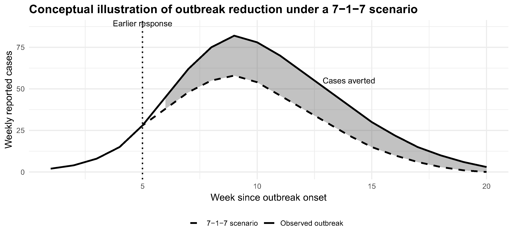

# Dengue 7-1-7 analysis — Thailand

This repository contains the Mathematica notebook and supporting files to reproduce analyses in:
"How much could faster outbreak response reduce dengue burden? 
A 7-1-7–inspired analysis using national surveillance data from Thailand."

## Contents
- notebooks/dengue_7-1-7_analysis.nb : main notebook
- figures/ : saved figure outputs

## Requirements
- Wolfram Mathematica >= 14 (tested)
- Recommended memory: 8GB for bootstrap
- To run: open the notebook, execute cells in order.

## Contact
For questions, contact: sompob@tropmedres.ac
